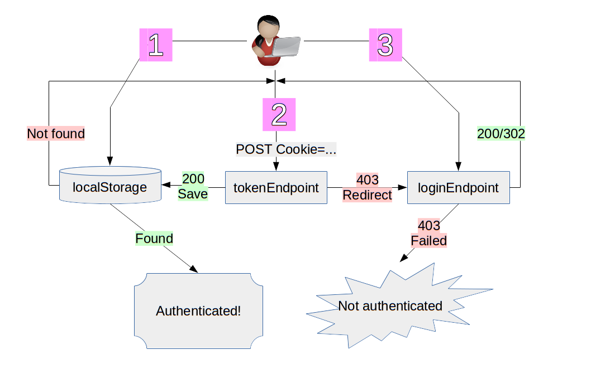
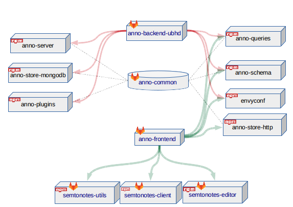

# anno

This monorepo contains packages that provide the building blocks for annotation
software implementing the [Web Annotation Data
Model](http://www.w3.org/TR/annotation-model/) and [Web Annotation
Protocol](http://www.w3.org/TR/annotation-protocol/).

Each repository is designed to provide a single feature to allow for broad
reuse of components.

<!-- BEGIN-MARKDOWN-TOC -->
* [Concepts](#concepts)
	* [Store](#store)
	* [Middleware](#middleware)
	* [Authentication](#authentication)
	* [Revisions](#revisions)
	* [Comments / Replies / Nesting](#comments--replies--nesting)
	* [URL schema](#url-schema)
	* [Extensions to Web Annotation Data Model](#extensions-to-web-annotation-data-model)
* [Modules](#modules)
* [Hacking](#hacking)

<!-- END-MARKDOWN-TOC -->

## Concepts

### Store

A store provides persistent storage of annotations. A store exposes methods
that reflect the [Web Annotation
Protocol](http://www.w3.org/TR/annotation-protocol/)and the [extensions
implemented of this framework](#extensions-to-web-annotation-data-model).

The [`store`](./anno-store) module is a
[proxy](https://en.wikipedia.org/wiki/Proxy_pattern) to the actual
implementation. It handles method dispatch and middleware and allows
instantiation from the environemnt. Actual stores must implement [its
interface](./store/README.md#interface).

The [`store-mongolike`](./anno-store-mongolike) module implements most of the
[`store` interface ](./anno-store/README.md#interface) for document databases,
such as [mongodb](https://mongodb.com) or
[NeDB](https://github.com/louischatriot/nedb).


### Middleware

When the method of a store is invoked, a **context** is created. The context is
just an object with the method parameters, such as the new annotation in the
case of `create` or the lookup ID in the case of `get`.

Before the method is actually dispatched, middleware can be injected to act
upon the context, modify it or cancel the operation. The mechanism is similar
to middleware in HTTP frameworks such as Express or Plack. Use cases for
middleware include:

* Validation: Detect invalid arguments for an operation
* Authentication: Inject a user id from a session into the context
* User lookup: Provide user details from an external data source, such as the
  display name.
* Authorization: Determine whether the calling user is allowed this operation.

### Authentication

Authentication is based on [JSON Web Tokens](https://jwt.io/).

To inspect your tokens, try [jwtinspector browser
extension](https://www.jwtinspector.io/#) which will detect JWT in HTTP traffic
and localStorage.



### Revisions

An `oa:Annotation` has `1..n` `annox:hasVersion` `annox:AnnotationRevision`.

`annox:hasVersion` is an ordered List.

The top-level `oa:Annotation` has the data from the latest revision as

* `body`
* `target`
* `creator`

The `modified` of the top-level `oa:Annotation` is the `created` of the latest
revision.

`hasVersion` is part of the
[`getMetadata`](https://github.com/kba/anno/tree/master/anno-store/#getmetadata)
store call/`HEAD` HTTP call.

### Comments / Replies / Nesting

### URL schema

ID is a [nice slugid](https://www.npmjs.com/package/slugid), based on uuid v4
without leading dash

```
<BASE_URL>/<ID>[.<REPLY_ID>]*[~<REVISION_ID>]
```

E.g.

* `http://localhost:3000/ewnfkjewnfew~2` Second revision
* `http://localhost:3000/ewnfkjewnfew.2.1~5` Fifth revision of first answer to second answer

Replies reply to the generic not versioned annotation (for sanity)

### Extensions to Web Annotation Data Model

Namespace for extensions is `https://kba.github.io/anno/#`, short `annox`.

Context is at `https://anno.github.io/anno/context.jsonld`

## Modules

Click on the image for links

<a href="./doc/repo-structure.svg"></a>

<!-- BEGIN-EVAL bash ./scripts/summarize.sh -->
- [anno-acl](./anno-acl): Authorization for anno-stores
- [anno-cli](./anno-cli): Command line interface for anno-*
- [anno-errors](./anno-errors): Shared errors for anno-*
- [anno-fixtures](./anno-fixtures): Sample data for testing and experimentation
- [anno-mw-acl-static](./anno-mw-acl-static): Authorization for anno-stores
- [anno-mw-user-static](./anno-mw-user-static): Hydrating a context with user information from fixed data
- [anno-queries](./anno-queries): Search and create fragments of Web Annotations
- [anno-schema](./anno-schema): JSON schema, OpenAPI and JSON-LD context
- [anno-server](./anno-server): Web Annotation Protocol server with extensions
- [anno-store](./anno-store): Interface for stores
- [anno-store-file](./anno-store-file): Flat file store based on NeDB
- [anno-store-http](./anno-store-http): HTTP Client to Web Annotation Protocol servers
- [anno-store-memory](./anno-store-memory): In-Memory store backed by NeDB
- [anno-store-mongodb](./anno-store-mongodb): MongoDB store
- [anno-store-mongolike](./anno-store-mongolike): Store base class for Mongo-like NoSQL databases
- [anno-test](./anno-test): 
- [anno-util](./anno-util): Utility functions
- [anno-webpack](./anno-webpack): Bundling the anno-* tools for browser use

<!-- END-EVAL -->

## Hacking

Modules are managed by [lerna](https://github.com/lerna/lerna)

```
npm install -g lerna
lerna bootstrap
```

